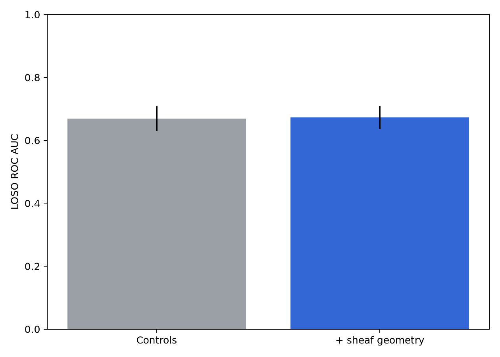
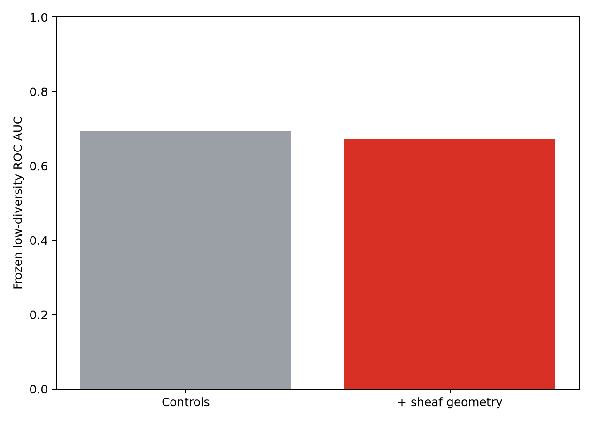
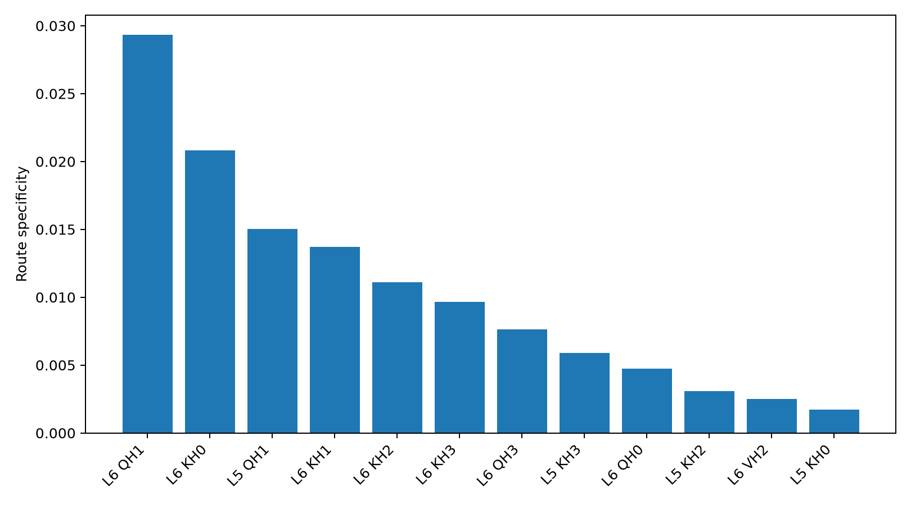
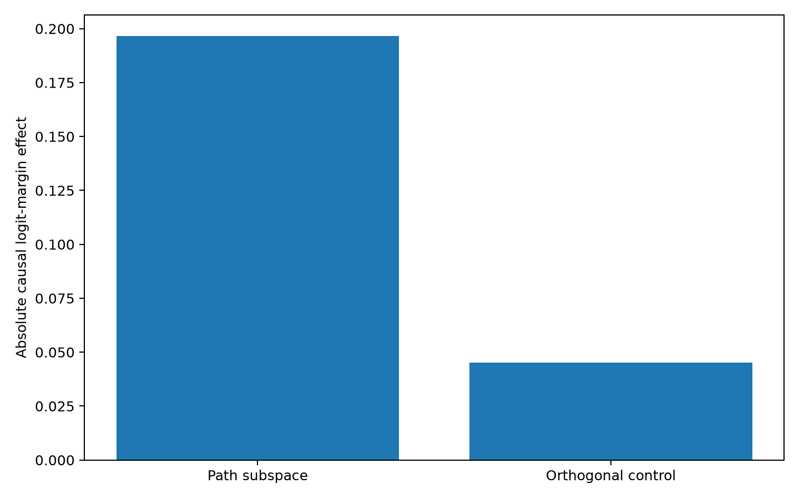
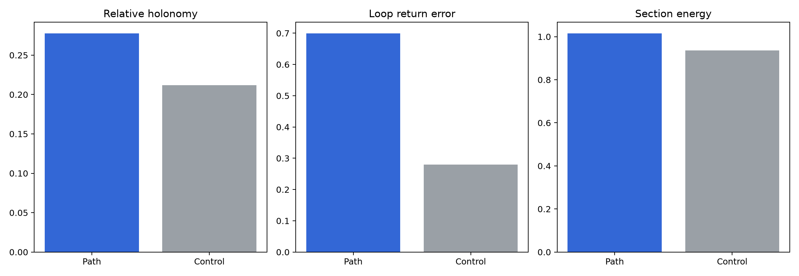

# Confirmatory family-global sheaf and path-circuit experiment

## What was tested

This run implements the six requested steps on all six saved 6-layer models. It
uses 1,408 newly generated equivalence diagrams: 128 examples from each of 11
families. Every expression that appeared in training, validation, ID/OOD test,
rewrite calibration, or an earlier diagram suite was excluded. Within each
truth-balanced family, 64 diagrams fit the chart and connection and 64 were
held out for evaluation.

The primary representation was fixed before inspecting correctness: a
family-global chart with dimension 8. Per-example reconstruction error, affine
loop-return error, and connection-sheaf section energy were averaged across
eight views: Q, K, V, and coupled QK at layers 5 and 6. Charts and transports
were fit without correctness labels.

The controls-only correctness model used unsigned confidence, expression
length, reconstruction error, family, true label, and seed. The geometry model
added loop-return error and section energy. The higher-diversity test used
leave-one-seed-out folds; preprocessing and coefficients were subsequently fit
on all higher-diversity rows, frozen, and evaluated unchanged on the three
low-diversity models. `double_negation` has no independent graph cycle, so its
loop value is structurally undefined; the model uses training-fold mean
imputation and an explicit missingness indicator.

## Correctness prediction result

| Evaluation | Model | Balanced accuracy | ROC AUC | Log loss | Brier |
|---|---|---:|---:|---:|---:|
| Higher diversity, LOSO mean | Controls | 0.623 | 0.670 | 0.654 | 0.230 |
| Higher diversity, LOSO mean | Controls + geometry | 0.620 | 0.672 | 0.652 | 0.230 |
| Frozen low diversity | Controls | 0.537 | 0.695 | 0.665 | 0.237 |
| Frozen low diversity | Controls + geometry | 0.550 | 0.671 | 0.677 | 0.240 |

The geometry adds only +0.003 mean AUC within the higher-diversity condition
and loses 0.023 AUC after frozen transfer. It also worsens low-diversity log
loss and Brier score. Therefore, the pooled family-global sheaf quantities are
not a robust correctness detector in this experiment.

## Targeted path circuits

The causal screen independently patched every Q/K/V head at layers 5 and 6.
The intervention asks whether donors reached through two logically equivalent
rewrite paths have more similar effects than family-and-label matched shuffled
donors. Seeds 0 and 1 selected candidates; seed 2 supplied the untouched sign
confirmation.

| Layer | Component | Head | Discovery specificity | Confirmation specificity |
|---:|---|---:|---:|---:|
| 6 | K | 1 | 0.0195 | 0.0022 |
| 6 | Q | 1 | 0.0139 | 0.0602 |
| 6 | K | 0 | 0.0100 | 0.0424 |

For each replicated site, an SVD learned a rank-4 direction set from calibration
path differences inside that one head. Patching only those directions changed
the true-class logit margin by 0.1965 on average across all six models. The next
four orthogonal directions changed it by only 0.0452, a 4.35-fold ratio. This is
substantially more localized than a whole-head circuit definition.

## Holonomy inside the causal circuit

The same family-global connection was re-fit after restricting activations to
the learned rank-4 path subspace or the equal-dimensional orthogonal control.

| Subspace | Relative holonomy | Loop-return error | Section energy |
|---|---:|---:|---:|
| Causal path subspace | 0.2778 | 0.6999 | 1.0160 |
| Orthogonal control | 0.2120 | 0.2803 | 0.9366 |

This is the main conceptual result: causal relevance and low holonomy do not
coincide. The path-sensitive directions are far more interventionally active,
but they have larger relative holonomy, return error, and section energy. In
this setting, holonomy is a useful descriptor of how a circuit transports
state, but it is not a monotone score of how important that circuit is to the
classifier. A plausible next test is whether the *structured pattern* of
eigenphases or family-specific curvature, rather than distance from identity,
predicts the circuit's computation.

The complete local artifact folder contains all per-view and per-example rows,
frozen coefficients, causal screens, targeted patch results, and circuit-local
geometry tables. Runs remain ignored by Git because the full artifact set is
approximately 57 MB; this report and the principal figures are versioned.
