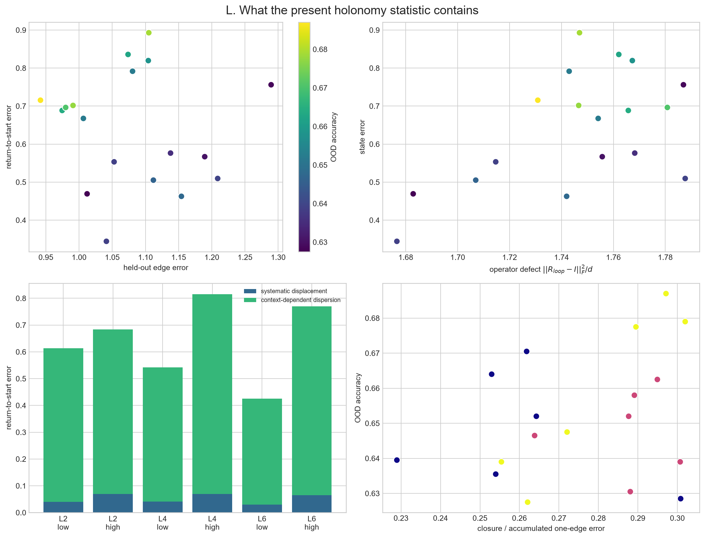
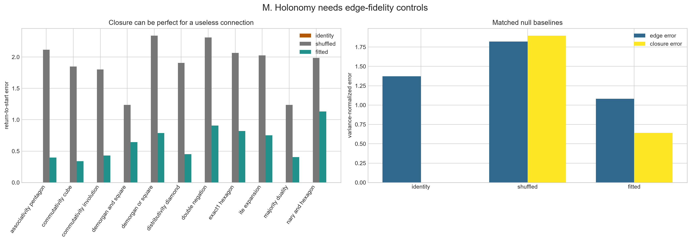
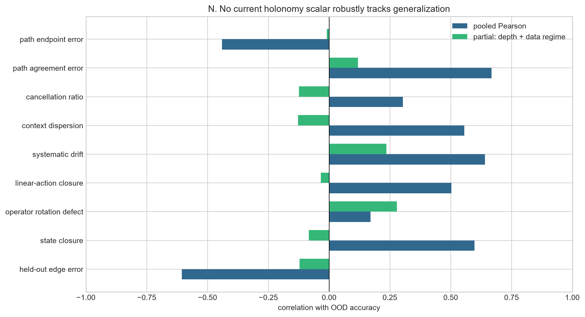

# Holonomy metric audit

## Verdict

The existing `holonomy_error` is correctly computed as the variance-normalized
displacement of held-out `<CLS>` states after composing fitted affine-orthogonal
rewrite maps around a closed path. It is therefore a useful *empirical
return-to-start diagnostic*. It is not, by itself, a reliable measure of learned
logical coherence or an intrinsic holonomy invariant.

The decisive counterexample is the identity connection: it has exactly zero loop
and path error for every diagram, although it does not transport a source state to
the representation of its rewritten target. Closure must therefore be conditioned
on independently measured edge fidelity.

## Matched-baseline results

All values are means over the same 18 saved models and eleven held-out families.

| Connection | Edge error | State closure | Rotation defect | Linear-action error | Cancellation ratio |
|---|---:|---:|---:|---:|---:|
| identity | 1.372 | 0.000 | 0.000 | 0.000 | 0.000 |
| shuffled | 1.822 | 1.897 | 1.992 | 1.974 | 0.368 |
| fitted | 1.081 | 0.642 | 1.746 | 0.704 | 0.276 |

The fitted state error decomposes exactly into a systematic mean displacement
(0.052, 8.2% of the total) and a context-dependent
dispersion term (0.590, 91.8%). The operator defect
measures the full linear map rather than only its action on sampled start states.

The fitted connection lowers held-out edge error by 21.2% relative
to identity, and it strongly beats the target-shuffled fit. It therefore captures
some rewrite structure. The problem is specifically that loop closure can be
optimized independently of correct transport.

## Relationship to OOD behavior

| Metric (lower is nominally better) | Pooled correlation | Partial correlation |
|---|---:|---:|
| transport error | -0.605 | -0.122 |
| holonomy error | +0.598 | -0.084 |
| holonomy rotation error | +0.170 | +0.279 |
| holonomy linear action error | +0.503 | -0.034 |
| holonomy systematic error | +0.641 | +0.236 |
| holonomy dispersion error | +0.556 | -0.127 |
| holonomy edge accumulation ratio | +0.304 | -0.124 |
| path agreement error | +0.668 | +0.119 |
| path endpoint error | -0.440 | -0.010 |

Partial correlations remove linear effects of architecture depth and training-data
regime. With only 18 models these values are diagnostics, not inferential evidence.

## What should count as holonomy here

For a path `p`, retain the composed affine map itself, `T_p(x)=xR_p+b_p`. For a
closed path report at least three quantities rather than one:

1. **Held-out edge fidelity:** whether each `T_e` predicts the actual next fiber.
2. **Operator holonomy:** `||R_p-I||_F^2/d`, plus a separately scaled affine drift.
3. **Data-supported holonomy:** return-to-start displacement on held-out states,
   split into systematic and context-dependent components.

For two routes with common endpoints, path curvature should be reported alongside
both routes' endpoint errors. Agreement between two equally wrong paths is not
coherence. There is no defensible single scalar until edge errors are substantially
below the identity and shuffled baselines.

## Why the current connection is provisional

- One global map is shared by every occurrence of a rewrite label, despite the
  observed context dependence of the representation change.
- Self-inverse rewrites reuse the same unconstrained Procrustes map in both
  directions; inverse and involution laws are tested only indirectly by a loop.
- The connection is fitted after training and is not a mechanism learned or used
  by the Transformer.
- Final-layer `<CLS>` states may discard local rewrite geometry present at the
  rewritten subtree or at earlier layers.
- Scalar variance normalization is orthogonally gauge-invariant, but it weights
  high-variance latent directions more heavily and can miss defects in task-relevant
  low-variance directions.

## Highest-value next experiment

Fit context-conditioned, bidirectionally constrained transports at every layer and
at the rewritten subtree token—not only final-layer `<CLS>`. Train forward and
inverse maps jointly, enforce `T_inverse T_forward ≈ I`, and evaluate on unseen
contexts. Compare against identity, target-shuffled, rewrite-label-shuffled, and
low-rank nulls. Only after held-out edge fidelity improves should loop curvature be
tested as a predictor of OOD accuracy.

Then add a causal version: patch the same semantic subtree through each competing
rewrite route and compare downstream logit changes. That tests whether path
coherence is used by the classifier rather than merely visible in geometry.

## Figures

