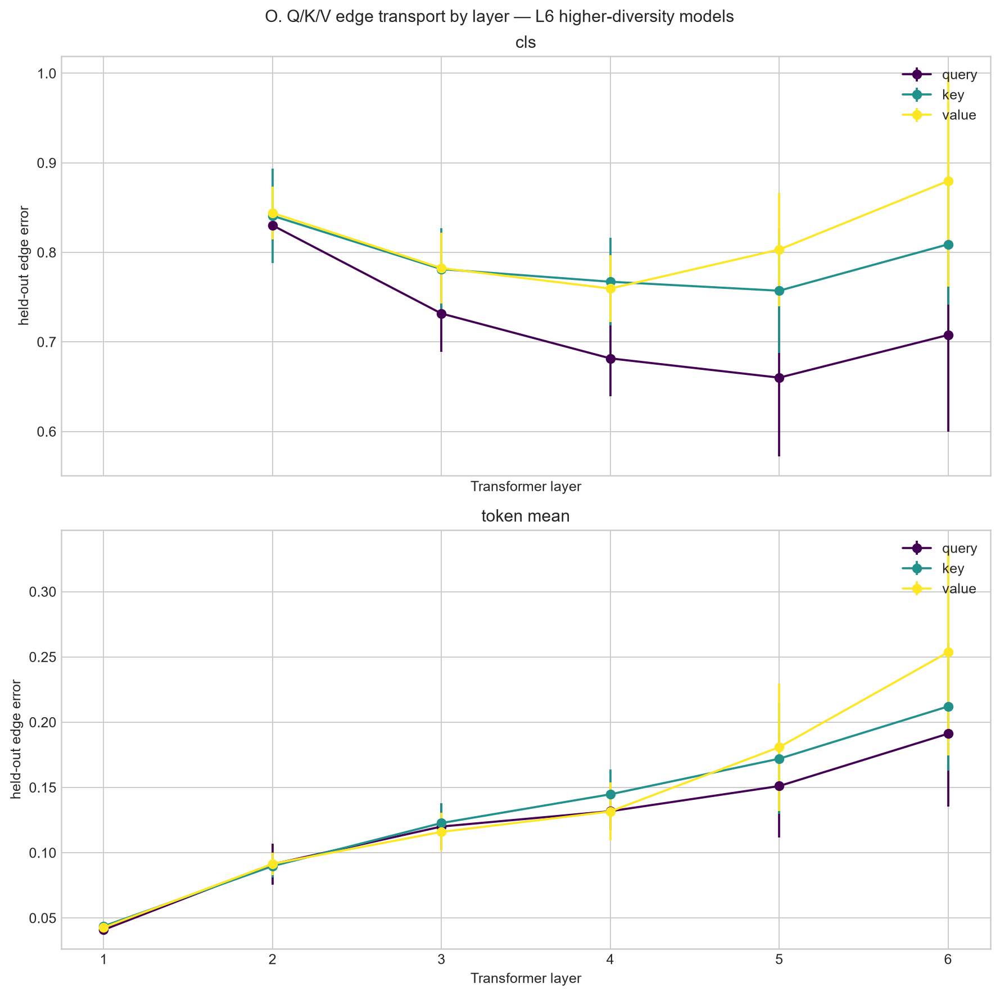
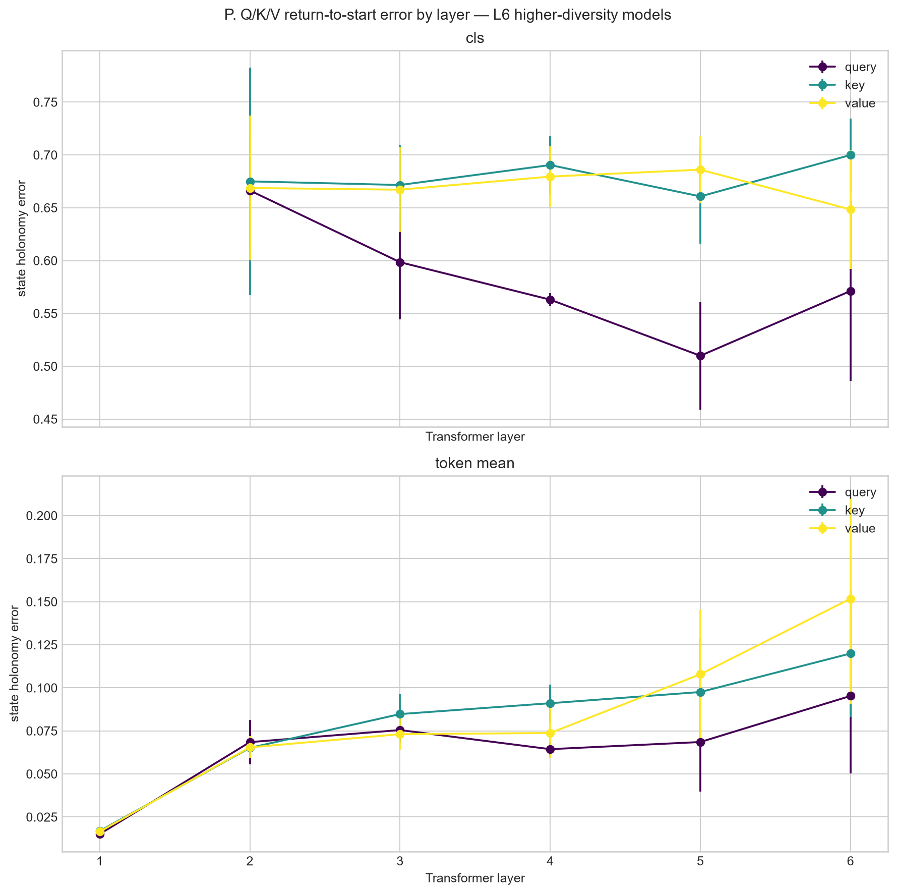
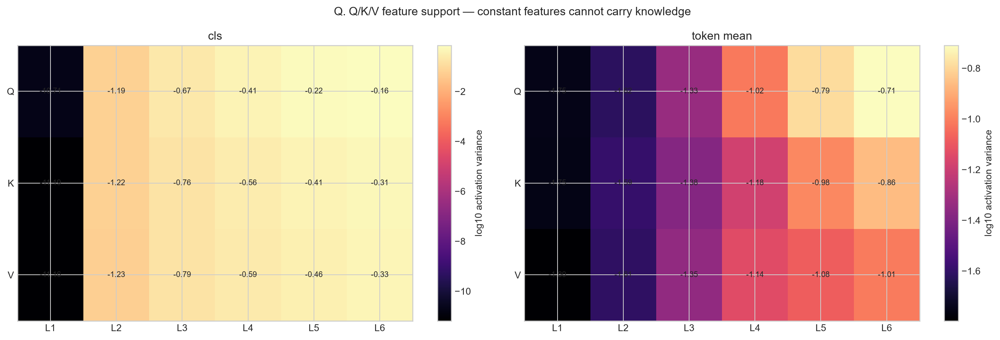
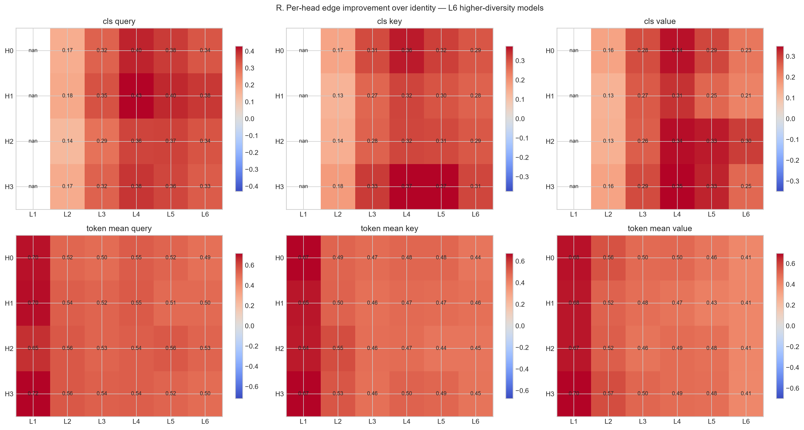
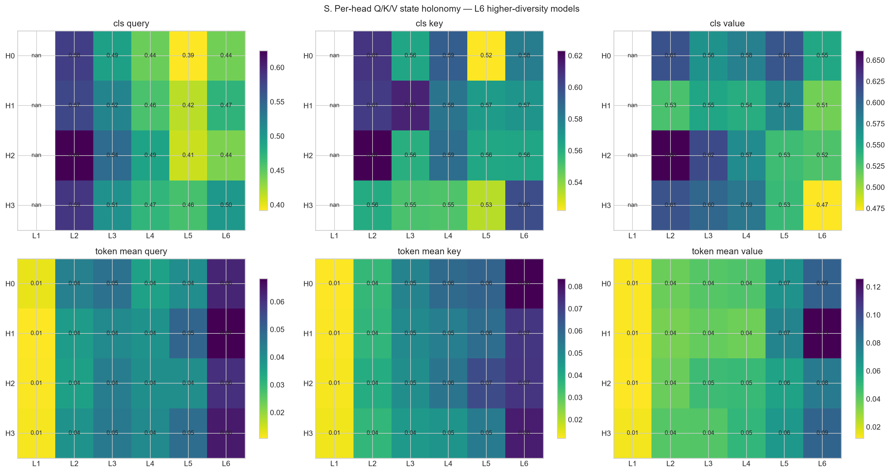
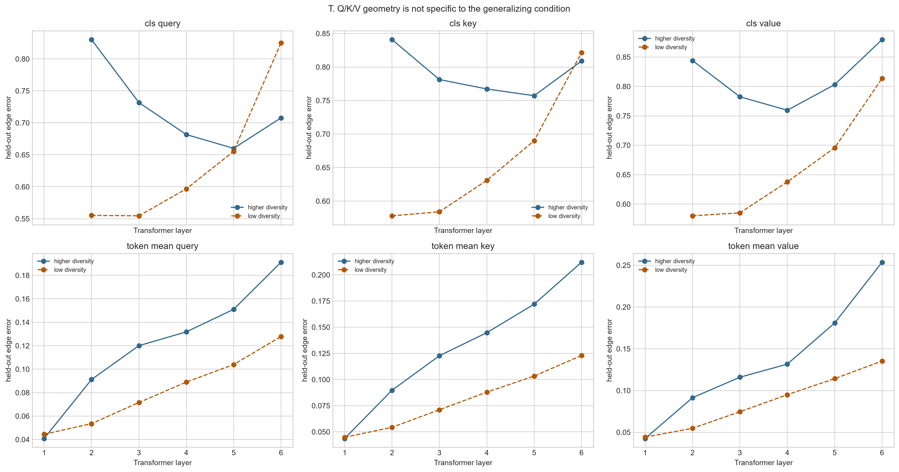

# Layerwise query/key/value holonomy report

## Scope and definition

This analysis uses the exact query, key, and value projections immediately before
self-attention in every Transformer layer. For this pre-norm encoder they are computed
from `norm1` of the incoming residual stream. They are activations, not network weights.

Two fixed-width views are tested independently: the Q/K/V vector at `<CLS>`, and the
mean Q/K/V vector across all non-padding, non-`<CLS>` tokens. Concatenated-head results
use all 128 dimensions; per-head results use 32 dimensions. Every rewrite calibration
set is exactly balanced: 96 false and 96 true examples per rewrite label.

Every site gets its own affine-orthogonal transports and variance normalization. Edge
error must beat identity before a small holonomy value is considered evidence.

## Primary comparison: six-layer higher-diversity models

Values are mean ± sample standard deviation across three seeds, after averaging all
eleven diagram families equally.

| Layer | Scope | Component | Variance | Identity edge | Fitted edge | Edge gain | State holonomy | Rotation defect |
|---:|---|---|---:|---:|---:|---:|---:|---:|
| 1 | cls | query | 1.94e-11 (degenerate) | n/a | n/a | n/a | n/a | n/a |
| 1 | cls | key | 6.50e-12 (degenerate) | n/a | n/a | n/a | n/a | n/a |
| 1 | cls | value | 6.97e-12 (degenerate) | n/a | n/a | n/a | n/a | n/a |
| 1 | token_mean | query | 0.018 | 0.168 ± 0.010 | 0.041 ± 0.000 | +75.6% | 0.015 ± 0.000 | 1.267 ± 0.013 |
| 1 | token_mean | key | 0.018 | 0.162 ± 0.013 | 0.044 ± 0.001 | +72.9% | 0.017 ± 0.001 | 1.273 ± 0.006 |
| 1 | token_mean | value | 0.016 | 0.170 ± 0.015 | 0.043 ± 0.001 | +74.7% | 0.017 ± 0.000 | 1.276 ± 0.014 |
| 2 | cls | query | 0.064 | 1.007 ± 0.132 | 0.830 ± 0.017 | +16.7% | 0.666 ± 0.054 | 1.692 ± 0.025 |
| 2 | cls | key | 0.060 | 1.009 ± 0.155 | 0.841 ± 0.053 | +15.8% | 0.675 ± 0.108 | 1.694 ± 0.028 |
| 2 | cls | value | 0.058 | 0.995 ± 0.129 | 0.844 ± 0.029 | +14.4% | 0.669 ± 0.069 | 1.689 ± 0.029 |
| 2 | token_mean | query | 0.024 | 0.209 ± 0.021 | 0.091 ± 0.016 | +56.7% | 0.068 ± 0.013 | 1.332 ± 0.022 |
| 2 | token_mean | key | 0.026 | 0.197 ± 0.008 | 0.090 ± 0.009 | +54.5% | 0.065 ± 0.006 | 1.330 ± 0.020 |
| 2 | token_mean | value | 0.025 | 0.210 ± 0.011 | 0.091 ± 0.008 | +56.5% | 0.065 ± 0.006 | 1.338 ± 0.019 |
| 3 | cls | query | 0.215 | 1.078 ± 0.113 | 0.732 ± 0.043 | +31.5% | 0.598 ± 0.054 | 1.691 ± 0.015 |
| 3 | cls | key | 0.172 | 1.115 ± 0.071 | 0.781 ± 0.046 | +29.6% | 0.672 ± 0.037 | 1.695 ± 0.020 |
| 3 | cls | value | 0.164 | 1.082 ± 0.071 | 0.782 ± 0.039 | +27.4% | 0.667 ± 0.040 | 1.686 ± 0.025 |
| 3 | token_mean | query | 0.047 | 0.252 ± 0.020 | 0.120 ± 0.018 | +52.4% | 0.075 ± 0.007 | 1.398 ± 0.014 |
| 3 | token_mean | key | 0.041 | 0.231 ± 0.014 | 0.123 ± 0.015 | +46.9% | 0.085 ± 0.011 | 1.395 ± 0.018 |
| 3 | token_mean | value | 0.045 | 0.228 ± 0.007 | 0.116 ± 0.015 | +49.2% | 0.073 ± 0.009 | 1.397 ± 0.020 |
| 4 | cls | query | 0.387 | 1.125 ± 0.063 | 0.682 ± 0.042 | +39.1% | 0.563 ± 0.006 | 1.682 ± 0.012 |
| 4 | cls | key | 0.273 | 1.164 ± 0.075 | 0.767 ± 0.049 | +33.7% | 0.690 ± 0.027 | 1.694 ± 0.019 |
| 4 | cls | value | 0.258 | 1.135 ± 0.056 | 0.760 ± 0.037 | +32.9% | 0.680 ± 0.029 | 1.690 ± 0.016 |
| 4 | token_mean | query | 0.097 | 0.288 ± 0.027 | 0.132 ± 0.014 | +54.3% | 0.064 ± 0.004 | 1.431 ± 0.013 |
| 4 | token_mean | key | 0.066 | 0.278 ± 0.014 | 0.145 ± 0.019 | +48.1% | 0.091 ± 0.011 | 1.432 ± 0.026 |
| 4 | token_mean | value | 0.073 | 0.255 ± 0.016 | 0.132 ± 0.022 | +48.6% | 0.074 ± 0.015 | 1.448 ± 0.017 |
| 5 | cls | query | 0.597 | 1.045 ± 0.048 | 0.660 ± 0.088 | +37.0% | 0.510 ± 0.051 | 1.691 ± 0.014 |
| 5 | cls | key | 0.391 | 1.114 ± 0.019 | 0.757 ± 0.070 | +32.1% | 0.661 ± 0.045 | 1.696 ± 0.011 |
| 5 | cls | value | 0.344 | 1.138 ± 0.037 | 0.803 ± 0.064 | +29.3% | 0.686 ± 0.032 | 1.695 ± 0.014 |
| 5 | token_mean | query | 0.163 | 0.320 ± 0.066 | 0.151 ± 0.040 | +53.1% | 0.069 ± 0.029 | 1.468 ± 0.033 |
| 5 | token_mean | key | 0.104 | 0.320 ± 0.047 | 0.172 ± 0.042 | +46.7% | 0.098 ± 0.031 | 1.467 ± 0.032 |
| 5 | token_mean | value | 0.083 | 0.332 ± 0.054 | 0.181 ± 0.049 | +46.2% | 0.108 ± 0.038 | 1.473 ± 0.026 |
| 6 | cls | query | 0.698 | 1.065 ± 0.113 | 0.708 ± 0.108 | +33.8% | 0.571 ± 0.085 | 1.704 ± 0.014 |
| 6 | cls | key | 0.485 | 1.129 ± 0.047 | 0.809 ± 0.067 | +28.4% | 0.700 ± 0.035 | 1.709 ± 0.007 |
| 6 | cls | value | 0.466 | 1.159 ± 0.027 | 0.880 ± 0.118 | +24.1% | 0.648 ± 0.056 | 1.713 ± 0.005 |
| 6 | token_mean | query | 0.195 | 0.380 ± 0.049 | 0.191 ± 0.056 | +50.3% | 0.095 ± 0.045 | 1.484 ± 0.034 |
| 6 | token_mean | key | 0.137 | 0.378 ± 0.047 | 0.212 ± 0.049 | +44.5% | 0.120 ± 0.037 | 1.490 ± 0.035 |
| 6 | token_mean | value | 0.098 | 0.422 ± 0.063 | 0.254 ± 0.079 | +40.9% | 0.152 ± 0.061 | 1.499 ± 0.030 |

## Localization summary

- Layer-1 token means have the lowest raw errors, but they are computed directly
  from token and position embeddings before attention. Their strong invariance is
  a lexical/bag-of-tokens baseline, not localized learned reasoning.
- Lowest fitted edge error after at least one attention layer: layer 2 token_mean key (0.090).
- Largest improvement over identity: layer 2 token_mean query (+56.7%).
- Lowest supported state holonomy: layer 4 token_mean query (0.064); this is interpretable only together with its edge gain.
- Best global `<CLS>` site: layer 5 query (edge 0.660, holonomy 0.510).
- Layer-1 `<CLS>` Q/K/V is constant across expressions before the first attention
operation. Its apparent zero geometry is marked degenerate, not coherent.
- `<CLS>` queries are consistently more transportable than keys or values in the
  middle and late layers. Per-head gains are broad rather than concentrated.
- Low-diversity controls frequently have equal or lower errors. The Q/K/V geometry
  therefore reflects shared structural regularity, not a generalization-specific
  knowledge location.

## Higher-diversity versus memorizing controls

The table averages supported layers for each six-layer condition. Layer-1 `<CLS>`
is excluded; token means include all layers.

| Scope | Component | Higher edge | Low edge | Higher holonomy | Low holonomy |
|---|---|---:|---:|---:|---:|
| cls | query | 0.722 | 0.637 | 0.582 | 0.493 |
| cls | key | 0.791 | 0.661 | 0.680 | 0.566 |
| cls | value | 0.814 | 0.662 | 0.670 | 0.568 |
| token_mean | query | 0.121 | 0.082 | 0.065 | 0.050 |
| token_mean | key | 0.131 | 0.081 | 0.079 | 0.052 |
| token_mean | value | 0.136 | 0.086 | 0.081 | 0.055 |

## Artifacts and interpretation

`family_metrics.csv` contains every model × layer × scope × component × head ×
diagram-family result. `model_metrics.csv` contains family-balanced model summaries,
and `aggregate_metrics.csv` contains seed aggregates. The per-head plot localizes
edge transport, while the concatenated-head plots allow rotations that mix heads.

A low value here does not prove that attention uses the corresponding feature. The
causal follow-up is to patch Q, K, or V at the identified layer/head and measure
whether alternative rewrite paths produce the same change in logits.

## Figures

