# Beyond squares: logical equivalence complexes in symbolic Transformers

Run: `equivalence_complex_20260902_211352_321084Z`  
Status: complete  
Runtime: approximately 12 minutes 15 seconds on an RTX 4090

## Executive conclusion

This experiment successfully extends the project from one De Morgan square to a
general system of variables, higher-arity operators, arbitrary directed diagrams,
closed loops, and competing rewrite paths. Eighteen width-128 Transformers were
trained across three architecture depths, two data regimes, and three seeds.

The behavioral result is positive but limited: diverse training data improves
generalization, and the 6-layer models perform best on unseen deeper expressions.
The strongest current geometric hypothesis is not supported. Models with better
OOD behavior do not have lower aggregate holonomy or path-agreement error. In fact,
the low-diversity memorizing controls often close loops more tightly. The isolated
rewrite transport error is a somewhat more promising signal, but the sample is too
small for a strong conclusion.

This is scientifically useful. It rules out treating small loop-closure error alone
as evidence that a model has learned globally coherent logical semantics. Edge
fidelity, non-degeneracy controls, and behavioral performance must be considered
together.

### Post-hoc metric audit

A dedicated [holonomy audit](holonomy_audit/report.md) now tests the fitted maps
against identity and target-shuffled connections. It confirms that the implemented
quantity is a valid held-out return-to-start error, but not a sufficient intrinsic
holonomy or coherence score: the identity connection closes every loop perfectly
while failing to perform the rewrites. The fitted connection does learn real edge
structure (21.2% lower edge error than identity), but its closure measures do not
robustly predict OOD behavior after controlling for depth and data regime.

## What was implemented

### Symbolic language

Examples now contain explicit assignments and expressions:

```text
<CLS> <ENV> x0=1 x1=0 x2=1 x3=0 <SEP> MAJ3 x0 x1 x2
```

The language includes:

- constants `0` and `1` and variables `x0` through `x5`;
- unary `NOT`;
- binary `AND`, `OR`, and `XOR`;
- arity-marked `AND3`, `AND4`, `OR3`, `OR4`, `XOR3`, and `XOR4`;
- fixed-arity `MAJ3`, `ITE3`, `EXACT1_3`, and `ATLEAST2_4`.

Binary forms are retained separately from n-ary forms so different parenthesizations
remain visible and associativity can be tested.

### General equivalence diagrams

The evaluation suite contains 96 data-disjoint instances of each of 11 families:

1. commutativity involution;
2. double-negation loop;
3. De Morgan `AND` square;
4. De Morgan `OR` square;
5. associativity pentagon;
6. n-ary `AND3` permutation hexagon;
7. eight-vertex commutativity cube with six square faces;
8. distributivity diamond with direct and indirect routes;
9. `ITE3` expansion/reduction loop;
10. `MAJ3` negation-duality loop;
11. `EXACT1_3` permutation hexagon.

This gives 1,056 held-out diagrams, 4,320 evaluated diagram vertices, 1,632 loop
instances, and 672 competing path pairs per model.

### Calibration and holdout

There are 27 named primitive rewrites. For each model, one affine orthogonal
transport is fitted from 192 isolated calibration pairs per rewrite. Primitive
transport error is evaluated on a separate 96-pair set. Complete multi-edge
topologies are generated with a third seed and never shown during fitting.

Train, validation, ID test, OOD test, calibration pairs, primitive test pairs, and
diagram expressions are explicitly string-disjoint.

This is a **topology holdout**, not a zero-shot rewrite-label holdout: transports
know the primitive rewrite label, but fitting never exposes a complete loop or
alternative-path diagram. Generalizing to an entirely unseen rewrite label would
require a parameterized transport model and is not claimed here.

## Experimental protocol

- Transformer layers: 2, 4, and 6
- Model width: 128; 4 attention heads; feed-forward width 256
- Seeds: 0, 1, and 2
- Low diversity: 512 training examples
- Higher diversity: 12,000 training examples
- Training expressions: maximum depth 3
- ID validation/test: maximum depth 3 and disjoint syntax
- OOD tests: 1,000 expressions each at exact depths 4 and 5
- Optimization: 2,000 AdamW steps, batch size 256
- Labels: approximately balanced globally

The low-diversity set is a prefix of the higher-diversity set, and every model sees
the same examples. Seeds change initialization and minibatch order.

## Behavioral results

Values are mean ± sample standard deviation over three seeds.

| Layers | Condition | Train | ID | OOD mean | OOD depth 4 | OOD depth 5 |
|---:|---|---:|---:|---:|---:|---:|
| 2 | low diversity | 1.000 ± 0.000 | 0.662 ± 0.014 | 0.635 ± 0.006 | 0.622 ± 0.011 | 0.647 ± 0.001 |
| 2 | higher diversity | 0.894 ± 0.007 | 0.715 ± 0.006 | 0.662 ± 0.009 | 0.659 ± 0.007 | 0.665 ± 0.016 |
| 4 | low diversity | 1.000 ± 0.000 | 0.664 ± 0.012 | 0.639 ± 0.008 | 0.636 ± 0.014 | 0.642 ± 0.003 |
| 4 | higher diversity | 0.992 ± 0.003 | 0.747 ± 0.014 | 0.658 ± 0.005 | 0.662 ± 0.011 | 0.653 ± 0.019 |
| 6 | low diversity | 1.000 ± 0.000 | 0.676 ± 0.014 | 0.638 ± 0.010 | 0.635 ± 0.009 | 0.641 ± 0.011 |
| 6 | higher diversity | 0.994 ± 0.002 | 0.741 ± 0.014 | **0.681 ± 0.005** | **0.696 ± 0.013** | **0.666 ± 0.005** |

Higher diversity improves mean OOD accuracy by 2.8, 1.9, and 4.3 percentage points
at 2, 4, and 6 layers respectively. Depth only produces a clear OOD benefit in the
higher-diversity 6-layer condition. The best individual run is L6/seed 0, with
75.0% ID, 71.1% depth-4, 66.3% depth-5, and 68.7% mean OOD accuracy.

The low-diversity models perfectly memorize 512 examples but still generalize to
about 64%. Unlike the original constant-only task, variables and repeated truth
functions allow them to learn useful local rules despite limited structural
coverage.

Validation accuracy improves almost entirely in the first 250 steps. Averaged over
the higher-diversity models, it peaks near 73.1% at step 750 while training loss
continues from 0.36 to 0.10. Later training therefore mostly sharpens the training
fit rather than improving ID behavior.

## Higher-arity operator results

Raw operator accuracy is label-confounded: for example, wide `AND` expressions are
usually false. Figure D therefore reports balanced accuracy. For the 6-layer,
higher-diversity models on exact-depth-5 OOD examples:

| Root operator | Balanced accuracy |
|---|---:|
| `OR3` | **0.813 ± 0.032** |
| `ATLEAST2_4` | 0.664 ± 0.073 |
| `NOT` | 0.651 ± 0.064 |
| binary `OR` | 0.635 ± 0.036 |
| binary `AND` | 0.607 ± 0.022 |
| `ITE3` | 0.566 ± 0.062 |
| `AND4` | 0.559 ± 0.013 |
| `OR4` | 0.551 ± 0.162 |
| `AND3` | 0.546 ± 0.015 |
| `MAJ3` | 0.546 ± 0.014 |
| binary `XOR` | 0.540 ± 0.063 |
| `EXACT1_3` | 0.520 ± 0.069 |
| `XOR3` | 0.494 ± 0.013 |
| `XOR4` | 0.488 ± 0.026 |

The system can represent and train on more-than-binary operators, but reliable
depth extrapolation is operator-specific. `OR3` is clearly learned; parity-like
operators remain around chance and are the dominant bottleneck.

## Diagram behavior and geometry

All errors below are variance-normalized. “Diagram accuracy” scores every vertex;
“consistency” is the fraction of diagrams receiving one prediction at all equivalent
vertices. Consistency is not sufficient by itself because a constant prediction is
perfectly consistent.

| Layers | Condition | Diagram accuracy | Consistency | Edge transport | Holonomy | Path agreement | Primitive rewrite |
|---:|---|---:|---:|---:|---:|---:|---:|
| 2 | low | 0.522 ± 0.013 | 0.427 ± 0.029 | 1.212 ± 0.076 | 0.614 ± 0.128 | 0.252 ± 0.057 | 1.214 ± 0.072 |
| 2 | higher | 0.576 ± 0.003 | 0.479 ± 0.017 | **0.987 ± 0.017** | 0.684 ± 0.015 | 0.329 ± 0.029 | **0.994 ± 0.035** |
| 4 | low | 0.533 ± 0.013 | 0.434 ± 0.017 | 1.118 ± 0.068 | 0.542 ± 0.032 | 0.144 ± 0.032 | 1.155 ± 0.099 |
| 4 | higher | 0.600 ± 0.009 | 0.486 ± 0.012 | 1.086 ± 0.016 | 0.816 ± 0.022 | 0.362 ± 0.087 | 1.125 ± 0.006 |
| 6 | low | 0.533 ± 0.007 | 0.462 ± 0.041 | 1.069 ± 0.075 | **0.425 ± 0.070** | **0.105 ± 0.035** | 1.104 ± 0.063 |
| 6 | higher | **0.612 ± 0.022** | **0.526 ± 0.015** | 1.013 ± 0.084 | 0.770 ± 0.107 | 0.355 ± 0.038 | 1.007 ± 0.070 |

The behavior and geometry separate:

- Higher diversity consistently improves semantic accuracy on diagram vertices.
- It does not reduce aggregate holonomy or competing-path error.
- The 6-layer low-diversity controls have the best loop/path closure despite worse
  OOD and diagram accuracy.
- Primitive and full-diagram edge transport errors are generally near one activation
  variance, so a single global affine map per rewrite is only a weak edge model.

Within the L6 higher-diversity models, the most favorable families are the
commutativity cube (transport 0.530, holonomy 0.417, path 0.134) and associativity
pentagon (transport 0.561, holonomy 0.492, path 0.117). The distributivity diamond
has reasonable semantic accuracy (0.624) but very poor path agreement (0.814).
The `EXACT1_3` and n-ary `AND3` permutation hexagons have holonomy above 1.1.

The best-generalizing isolated rewrite maps for L6 higher-diversity models are
contextual XOR commutation (0.456), inverse associativity (0.497), contextual OR
commutation (0.621), and forward associativity (0.638). Root-level OR commutation,
ITE expansion/reduction, and double negation have errors above 1.2. This strong
context dependence argues against one global transport per rewrite label.

## Correlations and hypothesis test

Pooled over all 18 models, OOD accuracy correlates with ID accuracy (+0.81), diagram
accuracy (+0.83), and consistency (+0.76). Pooled OOD correlation with holonomy is
**+0.60** and with path error **+0.67**: better-performing models actually have
larger errors. These pooled values are confounded by training condition.

Within the nine higher-diversity models:

- holonomy versus OOD: +0.02;
- path error versus OOD: +0.17;
- diagram accuracy versus OOD: +0.41;
- primitive rewrite transport versus OOD: -0.56.

After linearly controlling architecture depth and data condition across all models,
the partial correlations are -0.08 for holonomy, +0.12 for path error, and -0.32 for
primitive rewrite transport. With only 18 models these are descriptive, not
inferential, but the predicted negative association between holonomy and OOD is
absent.

The result falsifies the simplest metric-level claim: low holonomy under the present
global Procrustes construction is not a reliable marker of compositional
generalization. It does not falsify every sheaf/coherence formulation. The poor
held-out edge fidelity suggests the transport model itself is too rigid, and low
loop error can arise from cancellation or approximately identity-like composition.

## Limitations and next experiment

1. Only three seeds and three architecture depths were tested.
2. Exact syntactic depth does not remove Boolean shortcuts such as `OR(1, deep_tree)`.
3. One global affine orthogonal map is fitted per rewrite label; the results show
   that transports are strongly context-dependent.
4. Complete topologies are held out, but primitive rewrite labels are not. True
   zero-shot rewrite-label transfer needs a transport conditioned on a structural
   description of the rewrite.
5. Final-layer `<CLS>` geometry may hide coherent local operator states.
6. Loop and path errors need matched nulls: identity maps, shuffled pairings,
   random orthogonal maps, and variance/rank-matched representations.

The highest-value follow-up is a context-conditioned transport model operating on
the rewritten subtree position at every layer. It should be tested against the
matched nulls above, with computational-depth-controlled data and more seeds.
Causal activation patching should then compare the two competing paths directly:
patch the same semantic subtree through each route and test whether the downstream
logit effects agree.

## Figures

### A. Training dynamics

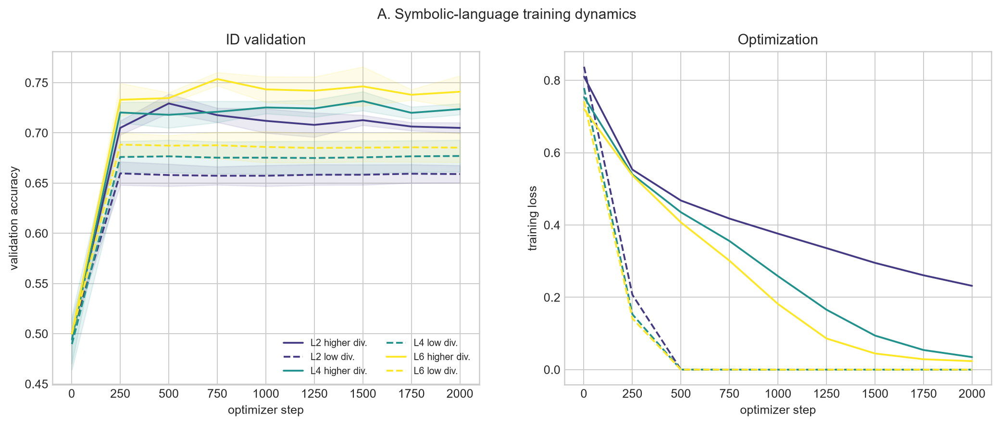

### B. ID and OOD behavior

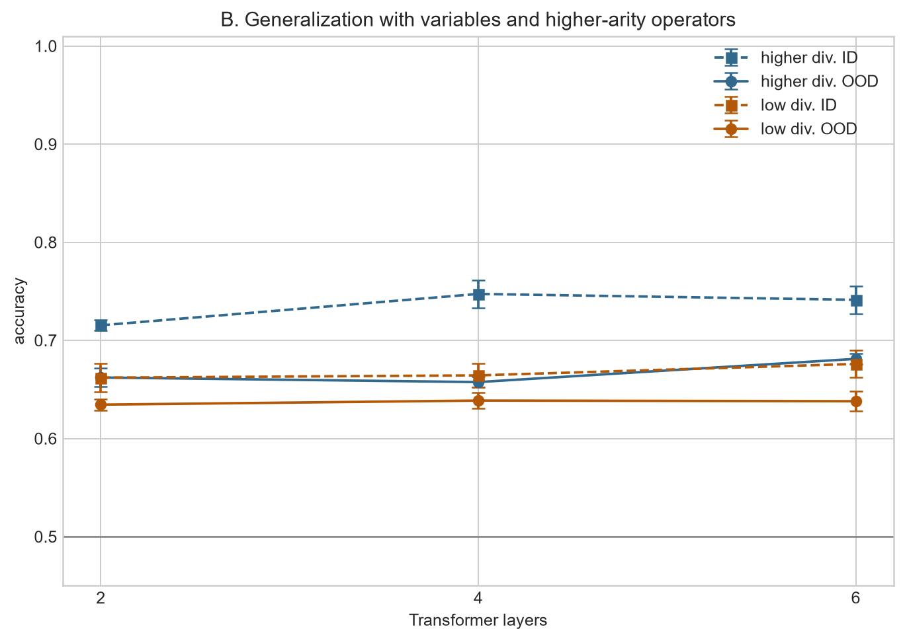

### C. Expression-depth generalization

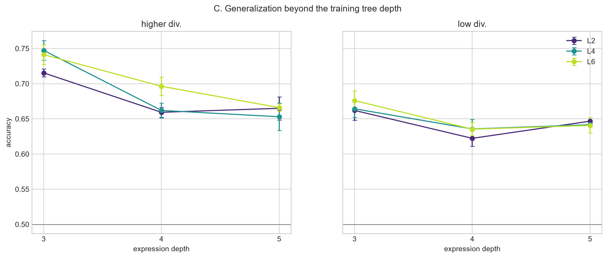

### D. Balanced root-operator accuracy

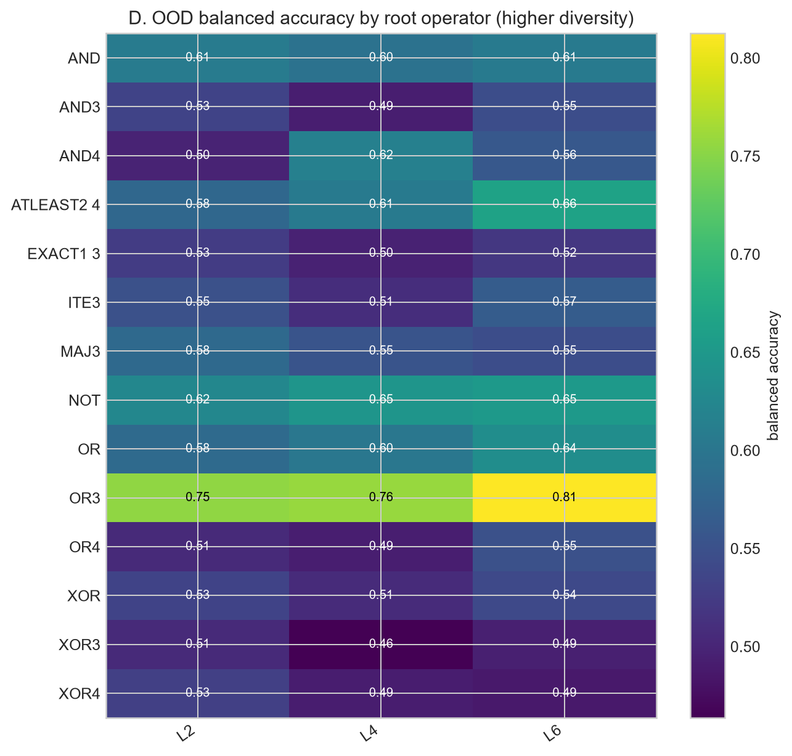

### E. Holonomy by equivalence family

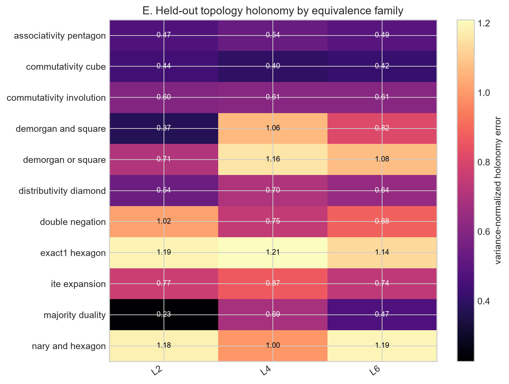

### F. Loop complexity and closure

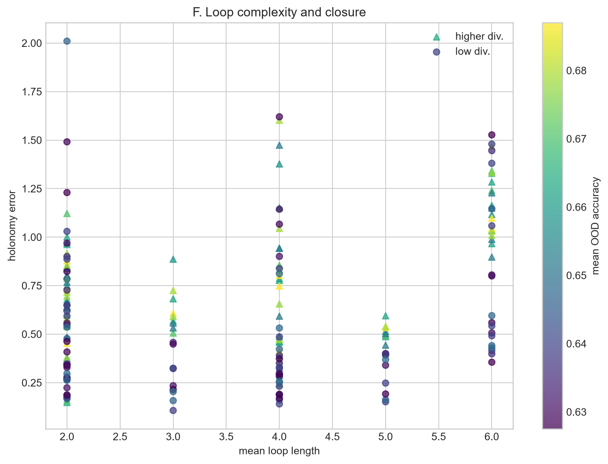

### G. Competing-path agreement

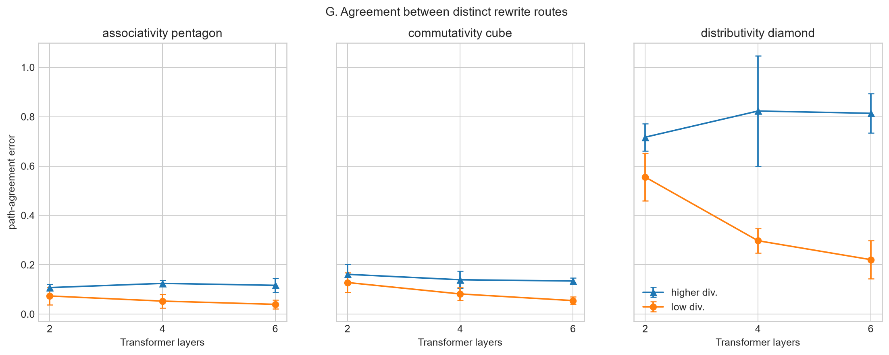

### H. Edge fidelity versus loop closure

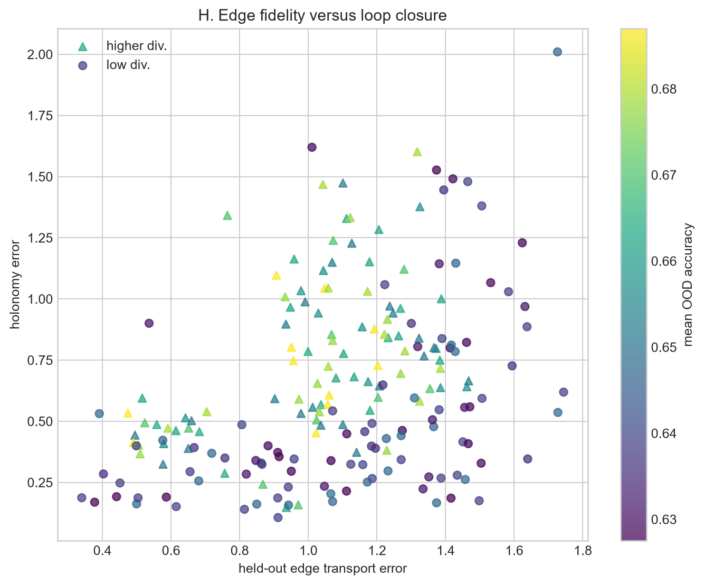

### I. Model-level correlation matrix

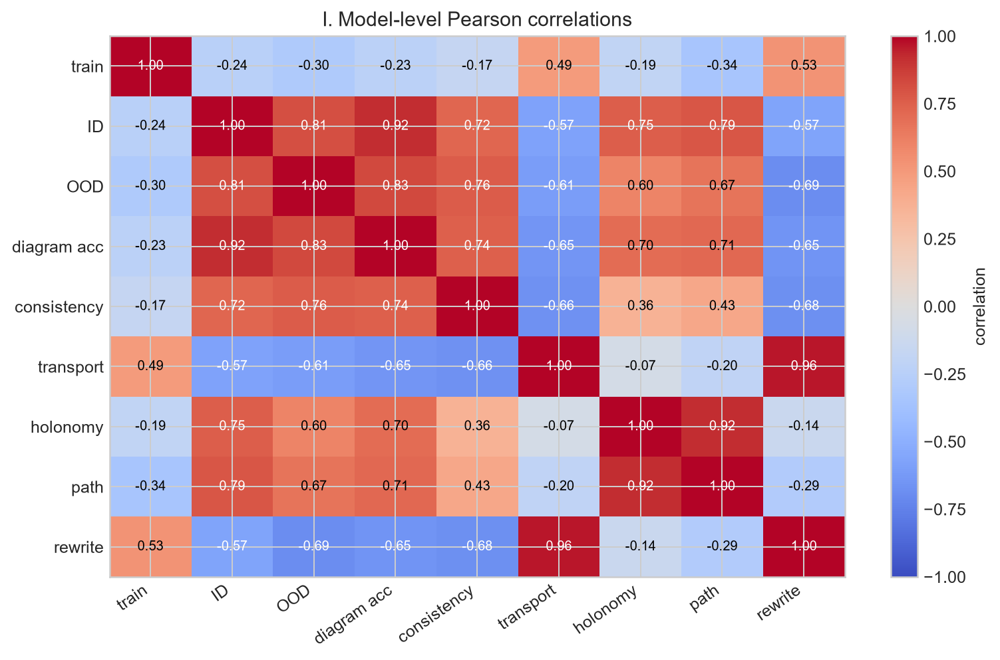

### J. Primitive rewrite transport errors

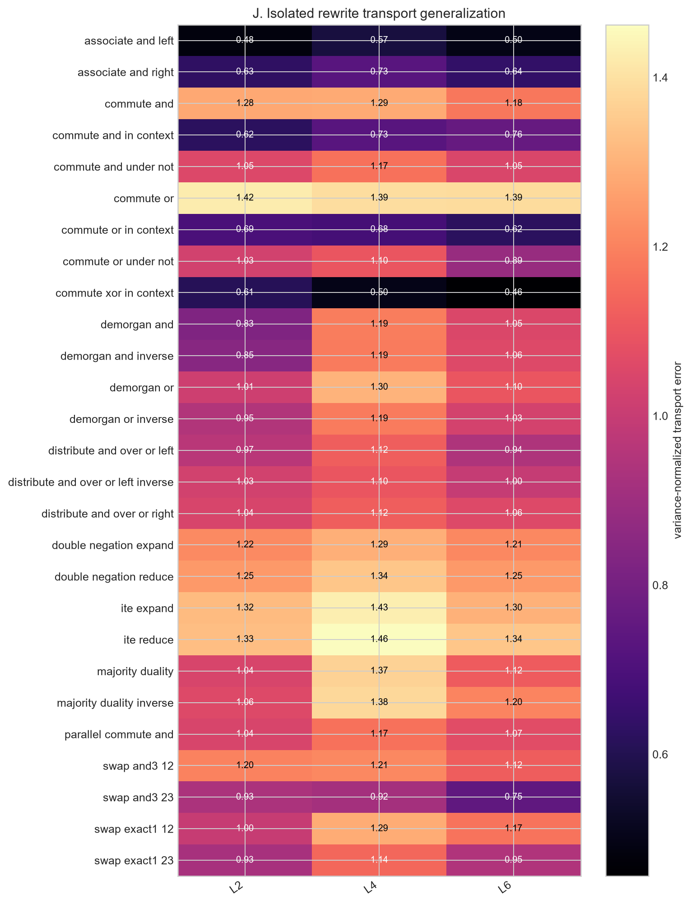

### K. Diagram atlas

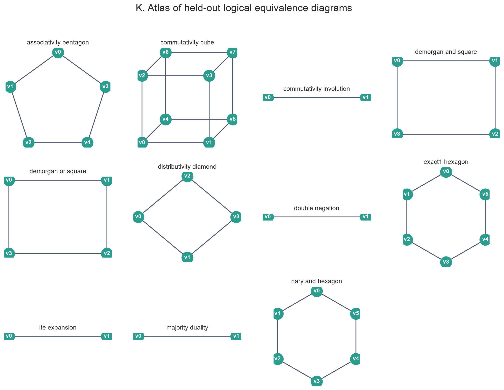

## Reproducibility and artifacts

- `config.json`: exact run configuration
- `status.json`: completion state and plot manifest
- `checkpoints/`: 18 model checkpoints and histories
- `tables/results.csv`: one row per model
- `tables/diagrams.csv`: one row per model and diagram family
- `tables/rewrites.csv`: one row per model and primitive rewrite
- `tables/operators.csv`: raw and balanced root-operator accuracy
- `tables/histories.csv`: optimizer trajectories
- `plots/`: figures A-K

The implementation protocol is documented in `docs/equivalence_complex.md` at the
repository root. The run directory is ignored by Git so checkpoints and generated
artifacts are stored locally unless deliberately packaged for release.
